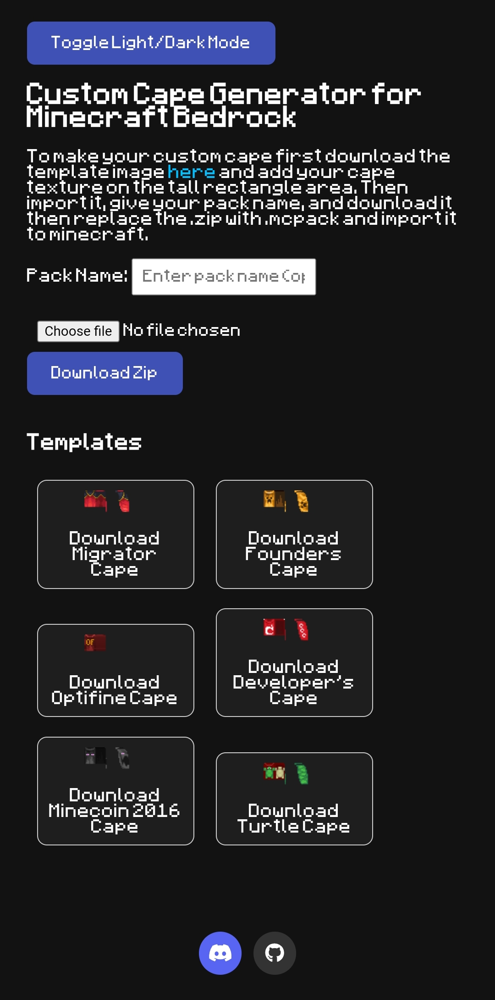

# Minecraft Bedrock Custom Cape Generator

**Create your own custom Minecraft Bedrock Edition capes with ease!**  
This web-based tool allows you to upload your own images and instantly generate a pack compatible with Minecraft Bedrock Edition.

## Features

- Upload your own cape design (64x32 or 128x64 PNGs)
- Automatically generates all required files
- Download a ready-to-import `.mcpack` file
- Clean and easy-to-use interface
- 100% client-side – no image data is stored or uploaded to a server
- it also some built-in templates for you to use

## Getting Started

Visit the live site here:  
**[https://packaverse.github.io/Custom-cape-generator-for-minecraft-Bedrock-edition/](https://packaverse.github.io/Custom-cape-generator-for-minecraft-Bedrock-edition/)**
